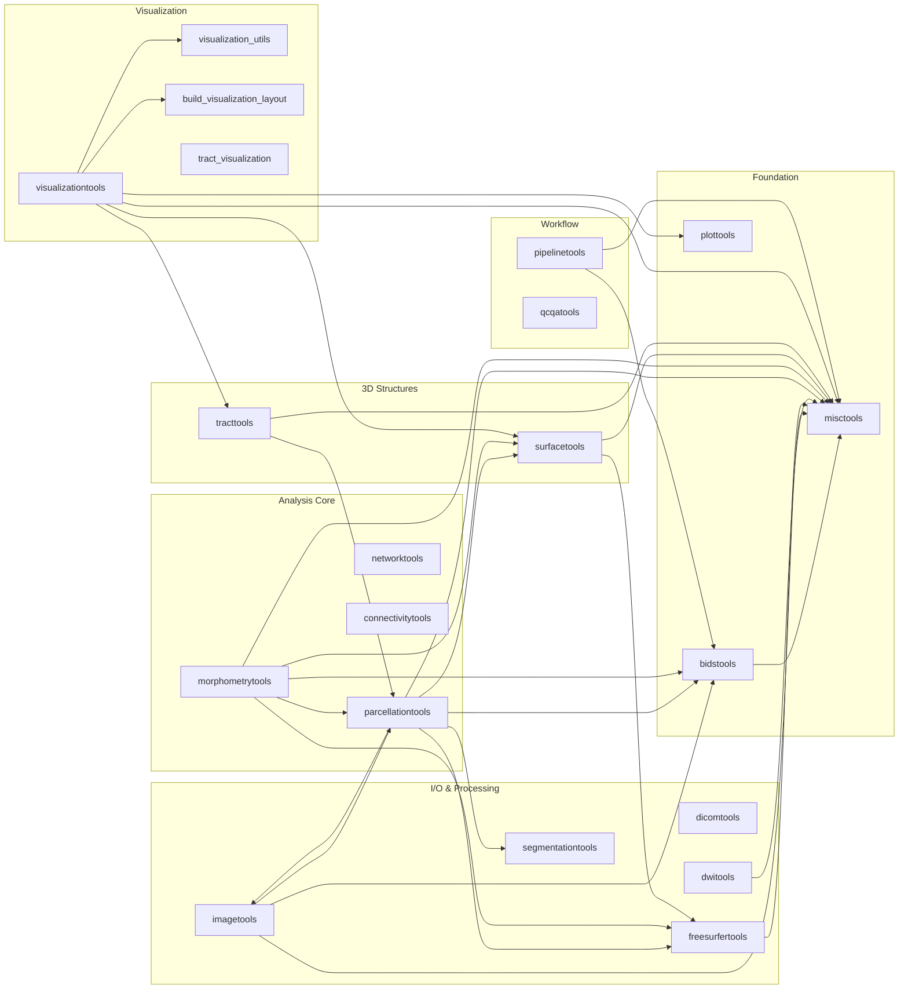
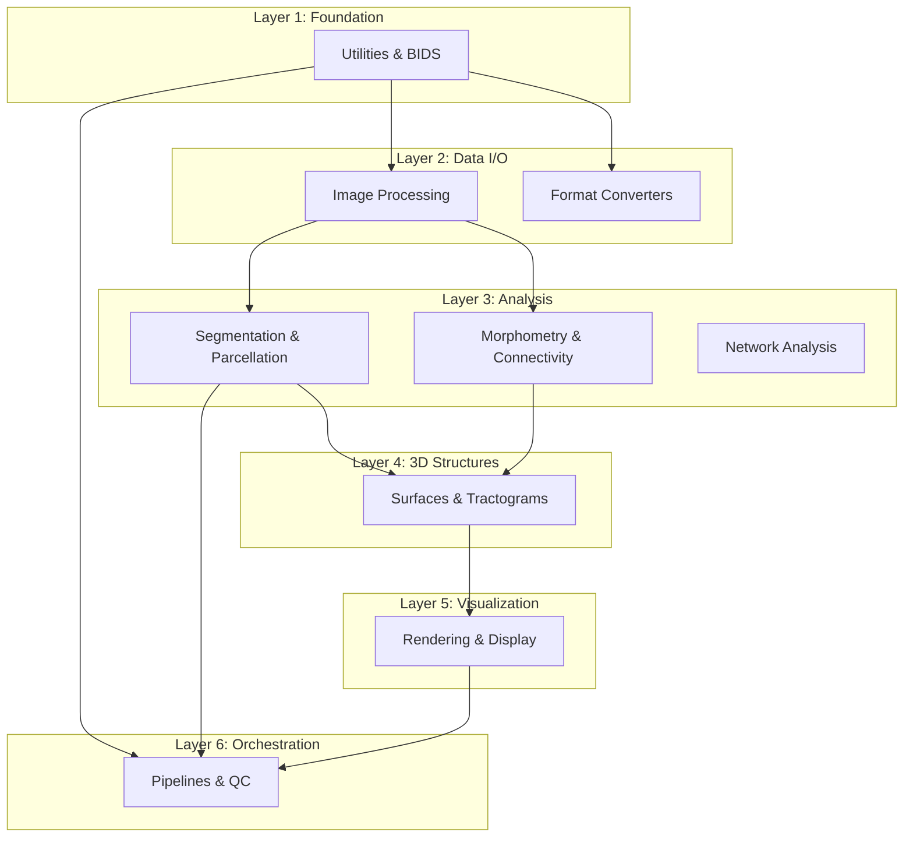
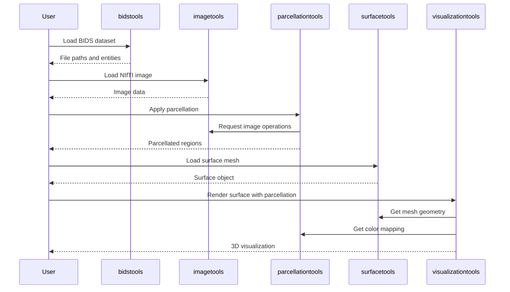

# Connectomics Lab Toolkit (clabtoolkit) - Software Architecture

## Overview
The Connectomics Lab Toolkit is a comprehensive Python package for neuroimaging data processing and analysis, specifically designed for brain connectivity research, BIDS datasets, and various neuroimaging formats.

## High-Level Architecture Diagram

```mermaid
graph TB
    subgraph "Core Utilities Layer"
        misctools[misctools<br/>Utility Functions]
        bidstools[bidstools<br/>BIDS Operations]
        plottools[plottools<br/>Plotting Utilities]
    end

    subgraph "Data I/O & Format Layer"
        imagetools[imagetools<br/>Image Processing]
        dicomtools[dicomtools<br/>DICOM Handling]
        freesurfertools[freesurfertools<br/>FreeSurfer I/O]
        dwitools[dwitools<br/>DWI Processing]
    end

    subgraph "Processing & Analysis Layer"
        parcellationtools[parcellationtools<br/>Parcellation]
        segmentationtools[segmentationtools<br/>Segmentation]
        morphometrytools[morphometrytools<br/>Morphometry]
        networktools[networktools<br/>Graph/Network Analysis]
        connectivitytools[connectivitytools<br/>Connectivity Analysis]
    end

    subgraph "Geometry & Structure Layer"
        surfacetools[surfacetools<br/>Surface Operations<br/>Class: Surface]
        tracttools[tracttools<br/>Tractography<br/>Class: Tractogram]
    end

    subgraph "Visualization Layer"
        visualizationtools[visualizationtools<br/>3D Visualization]
        visualization_utils[visualization_utils<br/>Viz Utilities]
        build_visualization_layout[build_visualization_layout<br/>Layout Builder]
        tract_visualization[tract_visualization<br/>Tract Viz]
    end

    subgraph "Pipeline & Workflow Layer"
        pipelinetools[pipelinetools<br/>Pipeline Execution]
        qcqatools[qcqatools<br/>Quality Control]
    end

    %% Core dependencies
    bidstools --> misctools
    pipelinetools --> misctools
    pipelinetools --> bidstools

    %% Data I/O dependencies
    imagetools --> misctools
    imagetools --> bidstools
    imagetools --> parcellationtools
    freesurfertools --> misctools
    dwitools --> misctools

    %% Processing dependencies
    parcellationtools --> misctools
    parcellationtools --> imagetools
    parcellationtools --> segmentationtools
    parcellationtools --> freesurfertools
    parcellationtools --> surfacetools
    parcellationtools --> bidstools

    morphometrytools --> misctools
    morphometrytools --> surfacetools
    morphometrytools --> parcellationtools
    morphometrytools --> bidstools
    morphometrytools --> freesurfertools

    %% Geometry dependencies
    surfacetools --> freesurfertools
    surfacetools --> misctools
    tracttools --> misctools
    tracttools --> parcellationtools

    %% Visualization dependencies
    visualizationtools --> misctools
    visualizationtools --> plottools
    visualizationtools --> surfacetools
    visualizationtools --> tracttools
    visualizationtools --> visualization_utils
    visualizationtools --> build_visualization_layout

    %% External Libraries
    ext_nibabel[nibabel]
    ext_numpy[numpy]
    ext_pyvista[PyVista]
    ext_scipy[scipy]
    ext_pandas[pandas]
    ext_dipy[DIPY]
    ext_rich[rich]

    imagetools -.-> ext_nibabel
    imagetools -.-> ext_numpy
    imagetools -.-> ext_scipy
    imagetools -.-> ext_pyvista
    surfacetools -.-> ext_pyvista
    tracttools -.-> ext_dipy
    visualizationtools -.-> ext_pyvista
    networktools -.-> ext_scipy
    pipelinetools -.-> ext_rich
    parcellationtools -.-> ext_rich

    style misctools fill:#e1f5ff
    style bidstools fill:#e1f5ff
    style visualizationtools fill:#ffe1f5
    style surfacetools fill:#fff5e1
    style tracttools fill:#fff5e1
    style pipelinetools fill:#f5e1ff
```

## Module Dependency Graph

## Key Components by Module

### Core Utilities
- **misctools**: General utility functions (file operations, string manipulation, data transformations)
- **bidstools**: BIDS naming conventions, entity manipulation, dataset navigation
- **plottools**: Matplotlib-based plotting utilities

### Data I/O & Format Handling
- **imagetools**:
  - Class: `MorphologicalOperations`
  - NIfTI image I/O, transformations, morphological operations
- **dicomtools**: DICOM file reading and conversion
- **freesurfertools**: FreeSurfer format I/O and integration
- **dwitools**: Diffusion-weighted imaging and tractography file handling

### Processing & Analysis
- **parcellationtools**: Brain parcellation schemes, ROI extraction, atlas operations
- **segmentationtools**: Image segmentation algorithms
- **morphometrytools**: Cortical thickness, surface-based morphometry
- **networktools**: Graph theory, CSR matrix operations, connected components
- **connectivitytools**: Connectivity matrix analysis, network statistics

### 3D Geometry & Structures
- **surfacetools**:
  - Class: `Surface`
  - Mesh operations, surface I/O, scalar data mapping
- **tracttools**:
  - Class: `Tractogram`
  - Tractography operations, streamline manipulation

### Visualization
- **visualizationtools**: Main 3D visualization interface using PyVista
- **visualization_utils**: Helper functions for visualization
- **build_visualization_layout**: Layout management for multi-view renders
- **tract_visualization**: Specialized tractography visualization

### Pipeline & Workflow
- **pipelinetools**: Pipeline execution, parallel processing with Rich progress bars
- **qcqatools**: Quality control and quality assurance

## Architecture Layers

## External Dependencies

### Major Libraries
- **nibabel**: Neuroimaging file I/O (NIfTI, FreeSurfer, GIFTI)
- **numpy**: Numerical operations and array processing
- **scipy**: Scientific computing, interpolation, morphological operations
- **pandas**: Data tables and structured data
- **PyVista**: 3D visualization and mesh processing
- **DIPY**: Diffusion imaging and tractography
- **rich**: Terminal formatting and progress bars
- **scikit-image**: Image processing algorithms

## Design Patterns

### 1. **Layered Architecture**
   - Clear separation between I/O, processing, and visualization layers
   - Each layer builds upon the previous one

### 2. **Class-Based Data Structures**
   - `Surface`: Encapsulates mesh geometry and scalar data
   - `Tractogram`: Encapsulates streamline data and properties
   - `MorphologicalOperations`: Provides morphological image operations

### 3. **BIDS-Centric Design**
   - Strong integration with BIDS naming conventions
   - Entity-based file organization and manipulation

### 4. **Modular Processing**
   - Independent modules for specific neuroimaging tasks
   - Clear interfaces between modules via imports

### 5. **External Library Integration**
   - Heavy use of scientific Python ecosystem
   - PyVista for visualization
   - DIPY for diffusion imaging

## Data Flow Example

## Module Statistics

| Module | Primary Purpose | Key Classes | Dependencies |
|--------|----------------|-------------|--------------|
| bidstools | BIDS operations | None | misctools |
| imagetools | Image I/O & processing | MorphologicalOperations | nibabel, scipy, misctools, bidstools |
| surfacetools | Surface manipulation | Surface | pyvista, freesurfertools, misctools |
| tracttools | Tractography | Tractogram | dipy, nibabel, misctools |
| visualizationtools | 3D rendering | None | pyvista, surfacetools, tracttools |
| parcellationtools | Parcellation | None | imagetools, surfacetools, freesurfertools |
| networktools | Graph analysis | None | scipy.sparse |
| pipelinetools | Workflow execution | None | rich, misctools, bidstools |

## Architecture Strengths

1. **Neuroimaging-Focused**: Purpose-built for connectomics and brain imaging research
2. **BIDS Integration**: First-class support for BIDS datasets
3. **Comprehensive Coverage**: Handles multiple neuroimaging modalities (structural, DWI, surfaces)
4. **Modern Visualization**: Uses PyVista for interactive 3D rendering
5. **Modular Design**: Clear separation of concerns with independent modules
6. **Rich User Experience**: Progress bars and formatted output using rich library

## Suggested Improvements

1. **API Documentation**: Consider adding a high-level API guide
2. **Plugin Architecture**: Could benefit from a plugin system for custom pipelines
3. **Configuration Management**: Centralized configuration for pipeline parameters
4. **Testing Infrastructure**: Unit tests for each module (if not already present)
5. **Async Operations**: Asynchronous I/O for large datasets
6. **Caching Layer**: Add caching for expensive computations
